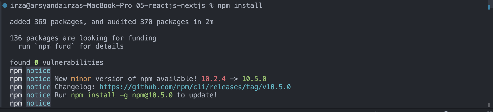
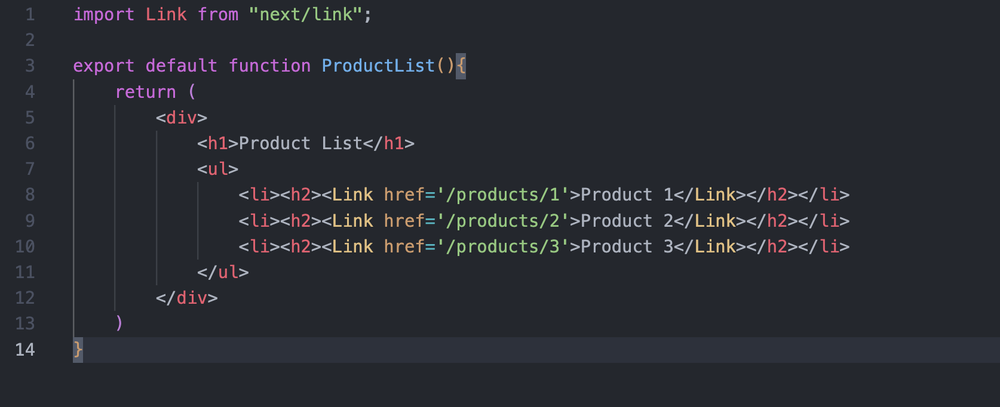
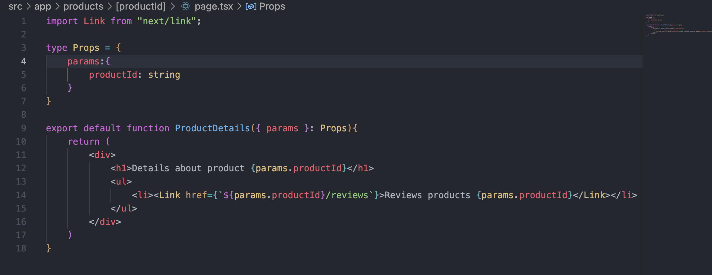
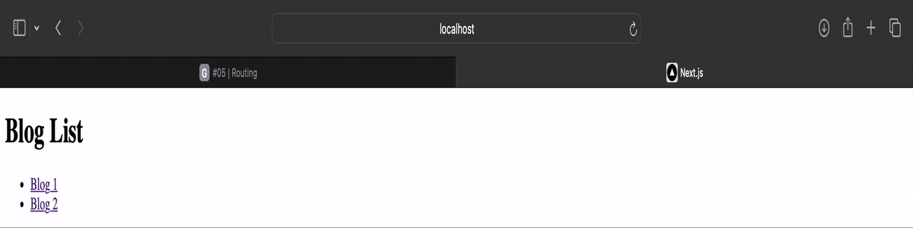
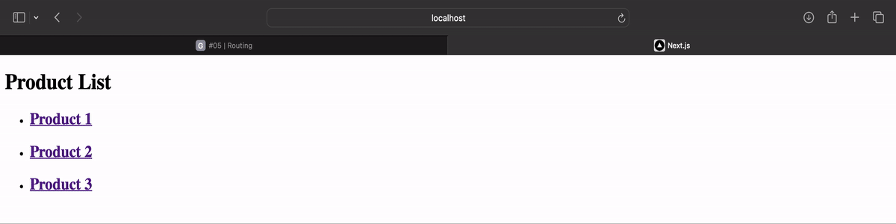
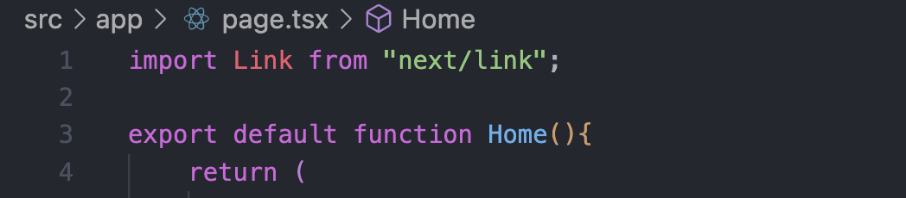
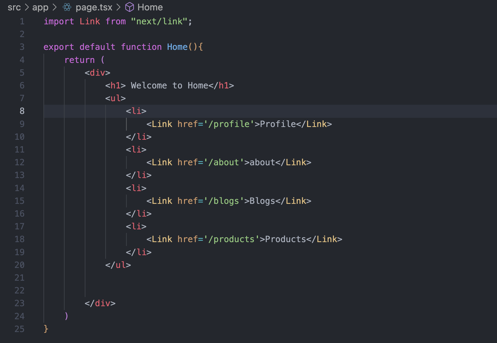
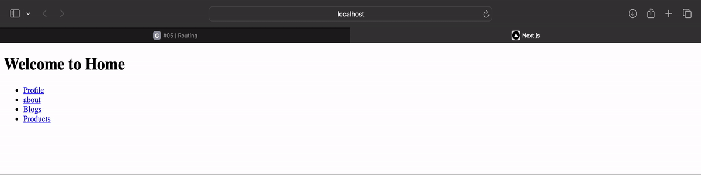
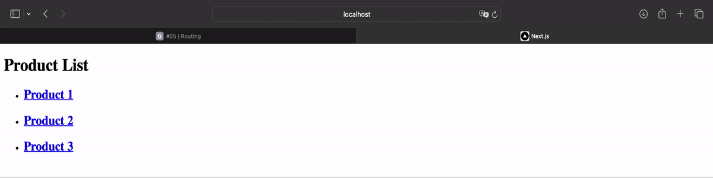

# 04 | ReactJS Dan NextJS

## Praktikum 1: Membuat routing sederhana

#### Langkah 2
>**Clone project ke lokal laptop anda dan lakukan instalasi dependencies dengan menjalankan perintah berikut.**



#### Langkah 4

>Routing di ReactJS dengan NextJS memanfaatkan organisasi penamaan folder dan file pada folder app. Silahkan tambahkan file page.tsx di dalam folder app, dan buatlah komponen dengan kode berikut.

```tsx
export default function Home() {
  return <h1>Welcome to Home</h1> ;
}
```


#### Layout 
> Perhatikan pada project di VSCode, akan terdapat sebuah file yang akan digenerate yaitu `layout.tsx.` File ini akan secara otomatis digenerate jika tidak ditemukan. Perhatikan susunan kode yang ada didalamnya. Anda akan menemukan susunan `html yang di dalamnya terdapat props children.` `Props children` akan di-replace oleh komponen sesuai dengan routing.


#### Langkah 7 
> Untuk membuat halaman routing `/about` dengan NextJS, silahkan buat folder `/about` dalam `/app` dan buat file dengan nama `page.tsx. `Kemudian buat function komponen seperti pada kode berikut.

```tsx
export default function About() {
  return <h1>Welcome to About</h1> ;
}
```


#### Profile **Todo**
 >Buatlah halaman `/profile` yang menampilkan isi biodata anda dengan menggunakan routing di `NextJS`

 


### Praktikum 2 

#### Langkah 2
>Pada file `/blogs/page.tsx` buatlah function component seperti kode berikut atau anda dapat mengkreasikan tampilan dengan selera anda!

```tsx
export default function Blog() {
  return (
        <h1>Blog</h1>
  );
}
```


#### Langkah 3 
>Pada file `/blogs/first/page.tsx` buatlah function component seperti berikut:

```tsx
export default function FirstBlog() {
  return (
        <h1>First Blog</h1>
  );
}
```


#### Blogs Second **Todo**

> Lengkapi function component pada `/blogs/second/page.tsx`

```tsx
export default function FirstBlog() {
    return (
        <h1>Second Blog</h1>
    );
}
```


#### **Pertanyaan**
>Apa kekurangan yang mungkin terjadi jika menggunakan pendekatan pada Praktikum 2 untuk menangani routing?

#### **Jawab**
>Jika menggunakan konsep routing seperti praktikum 2, struktur folder menjadi kaku sehingga sulit diubah seiring perubahan aplikasi, selain itu jika ada perubahan struktur routing bisa jadi rumit dan memakan waktu yang banyak.


### Praktikum 3

#### Langkah 1

>Buatlah file `/products/page.tsx` yang berisi function component untuk menampilkan list dari products seperti kode berikut.

```tsx
export default function ProductList() {
  return (
        <div>
          <h1>Product List</h1>
          <h2>Product 1</h2>
          <h2>Product 2</h2>
          <h2>Product 3</h2>
        </div>
  );
}
```


#### Langkah 3

>Kemudian buatlah file page.tsx pada lokasi `/app/products/[productId]` dan tambahkan kode sebagai berikut.

```tsx
type Props = {
  params: {
        productId: string
  }
}

export default function ProductDetails({ params }: Props) {
  return (
        <h1>Details about product {params.productId}</h1>
  )
}
```


#### **Todo** 1

>Perbaiki implementasi Praktikum 2 menggunakan Dynamic Routes



#### **Todo** 2

>Dengan menggunakan konsep Nested Routes dan Dynamic Routes, buatlah halaman dengan `routing /products/[productId]/reviews/[reviewId]`



### Praktikum 4

#### Langkah 1

>Pada file `/app/page.tsx`tambahkan import Link komponen seperti kode berikut.

```tsx

import Link from "next/link";

```


#### Langkah 2

>Tambahkan penggunaan Link komponen untuk mengakses halaman `/profile` dan ` /about`

```tsx
export default function Home() {
  return (
        <div>
          <h1>Welcome to Home</h1>
          <Link href='/profile'>Profile</Link>
          <Link href='/about'>About</Link>
        </div>
  );
}
```



#### **Todo** 

>Tambahkan link yang sebelumnya anda telah kerjakan!

