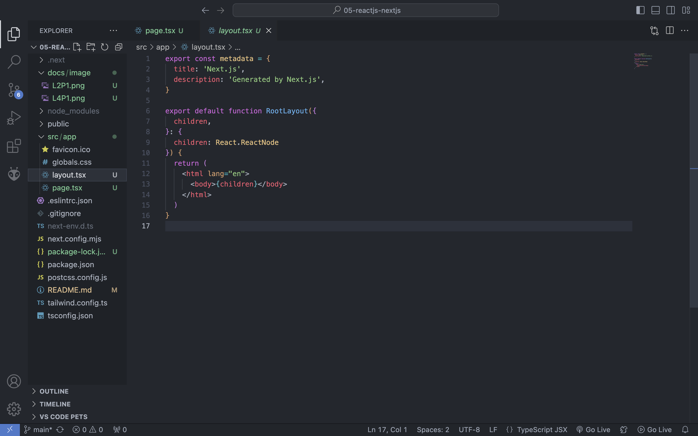
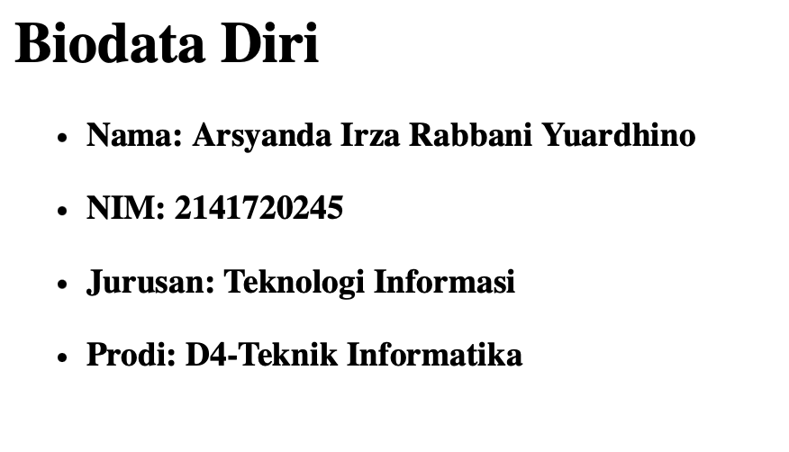

# 04 | ReactJS Dan NextJS

## Praktikum 1: Membuat routing sederhana

#### Langkah 2
>**Clone project ke lokal laptop anda dan lakukan instalasi dependencies dengan menjalankan perintah berikut.**


#### Langkah 4

>Routing di ReactJS dengan NextJS memanfaatkan organisasi penamaan folder dan file pada folder app. Silahkan tambahkan file page.tsx di dalam folder app, dan buatlah komponen dengan kode berikut.

```tsx
export default function Home() {
  return <h1>Welcome to Home</h1> ;
}
```


#### Layout 
> Perhatikan pada project di VSCode, akan terdapat sebuah file yang akan digenerate yaitu `layout.tsx.` File ini akan secara otomatis digenerate jika tidak ditemukan. Perhatikan susunan kode yang ada didalamnya. Anda akan menemukan susunan `html yang di dalamnya terdapat props children.` `Props children` akan di-replace oleh komponen sesuai dengan routing.



#### Langkah 7 
> Untuk membuat halaman routing `/about` dengan NextJS, silahkan buat folder `/about` dalam `/app` dan buat file dengan nama `page.tsx. `Kemudian buat function komponen seperti pada kode berikut.

```tsx
export default function About() {
  return <h1>Welcome to About</h1> ;
}
```


#### Profile **Todo**
 >Buatlah halaman `/profile` yang menampilkan isi biodata anda dengan menggunakan routing di `NextJS`

 
